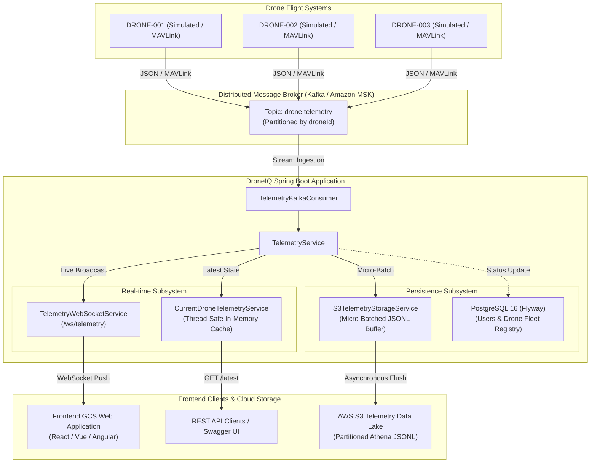

# DroneIQ System Architecture

## 1. System Overview

DroneIQ is a production-quality, modular backend for an enterprise Drone Ground Control Station (GCS) web application. It ingests high-frequency drone telemetry, normalizes the data, streams real-time updates over low-latency WebSockets to browser-based operators, provides instantaneous state query REST APIs, and micro-batches raw telemetry into an AWS S3 Data Lake for analytical processing (AWS Athena / QuickSight).

---

## 2. End-to-End Architecture Pipeline

---

## 3. Core Architectural Principles & Subsystems

### A. Modular Ingestion via Apache Kafka / Amazon MSK
- Telemetry records are produced with `droneId` as the Kafka partition key.
- Guarantees strict in-order message delivery per individual drone.
- **Swappability**: The configuration in `application.yml` maps to standard Kafka producer/consumer properties. Upgrading from local KRaft Kafka to managed Amazon MSK requires **zero code changes**—only changing `KAFKA_BOOTSTRAP_SERVERS` and SASL/IAM security properties in the environment.

### B. Low-Latency Real-Time WebSocket Layer
- **Endpoint**: `/ws/telemetry`
- **First-Message In-Band Authentication**: Avoids token exposure in HTTP URL query strings and adheres to strict RFC 6455 browser WebSocket limits.
- **Subscription Awareness**: Clients can subscribe to specific drones (`{"type":"SUBSCRIBE","droneId":"..."}`) or monitor the entire fleet (`{"type":"SUBSCRIBE_ALL"}`).

### C. Low-Latency State Caching Layer
- Backed by `CurrentDroneTelemetryService` interface.
- Current implementation uses a concurrent lock-free `ConcurrentHashMap` for sub-millisecond retrieval of the latest known coordinates, speed, battery, and heading.
- **Swappability**: Can be transparently swapped with a Redis-backed implementation (`RedisCurrentDroneTelemetryService`) in multi-instance horizontally scaled deployments without modifying controller or business logic.

### D. Dual-Tier Storage Architecture
1. **Relational Database (PostgreSQL 16 via Flyway)**:
   - Stores relational entities: registered users, roles, password hashes, and drone fleet metadata.
   - **Crucial Design Rule**: High-frequency raw telemetry is NEVER written as row-by-row relational inserts, preventing database bloat and I/O bottlenecks.
2. **Object Storage Data Lake (AWS S3)**:
   - High-throughput telemetry is buffered in memory and flushed in micro-batches (e.g., 50 records or 10-second intervals) as newline-delimited JSON (`.jsonl`).
   - Hive-style directory partitioning:
     `telemetry/year=YYYY/month=MM/day=DD/drone_id={droneId}/`
   - Optimized for instant serverless querying via AWS Athena and ETL transformations.

### E. Fault Domain Isolation
- **Non-blocking Storage**: S3 storage operations run asynchronously. Any network latency, S3 API throttling, or AWS outage **never degrades or pauses** live WebSocket broadcasting to ground operators.
- **Offline Local Development**: When S3 credentials are not configured, `NoOpTelemetryStorageService` activates automatically, allowing full local development without AWS accounts.
